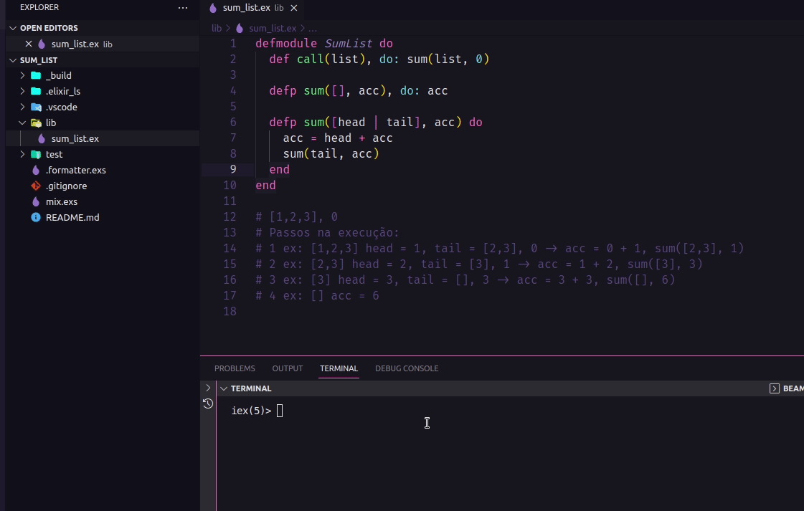

<div align="center" id="top"> 
  

&#xa0;

  <!-- <a href="https://sum_list.netlify.app">Demo</a> -->
</div>

<h1 align="center">Sum_list</h1>

<p align="center">
  

  

  

  

</p>

<p align="center">
  <a href="#dart-about">About</a> &#xa0; | &#xa0;   
  <a href="#rocket-technologies">Technologies</a> &#xa0; | &#xa0;
  <a href="#white_check_mark-requirements">Requirements</a> &#xa0; | &#xa0;
  <a href="#checkered_flag-starting">Starting</a> &#xa0; | &#xa0;
  <a href="#memo-license">License</a> &#xa0; | &#xa0;
  <a href="https://github.com/wsasouza" target="_blank">Author</a>
</p>

<br>

## :dart: About

Meus primeiros passos com Elixir.
Função que soma uma lista de números.

## :rocket: Technologies

The following tools were used in this project:

- [Elixir](https://elixir-lang.org/)

## :white_check_mark: Requirements

Before starting :checkered_flag:, you need to have [Git](https://git-scm.com) installed.

## :checkered_flag: Starting

If [available in Hex](https://hex.pm/docs/publish), the package can be installed
by adding `sum_list` to your list of dependencies in `mix.exs`:

```bash
# Clone this project
$ git clone https://github.com/wsasouza/elixir-fundamentos

# Access
$ cd elixir-fundamentos

```

Documentation can be generated with [ExDoc](https://github.com/elixir-lang/ex_doc)
and published on [HexDocs](https://hexdocs.pm). Once published, the docs can
be found at [https://hexdocs.pm/sum_list](https://hexdocs.pm/sum_list).

## :memo: License

This project is under license from MIT. For more details, see the [LICENSE](LICENSE.md) file.

Made with :heart: by <a href="https://github.com/wsasouza" target="_blank">Walter Santos de Andrade Souza</a>

&#xa0;

<a href="#top">Back to top</a>
